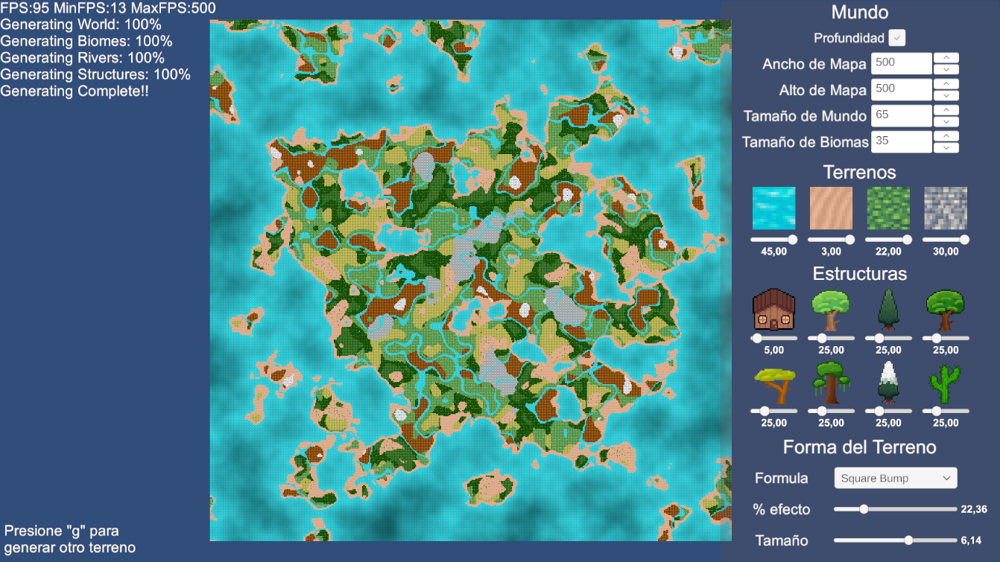
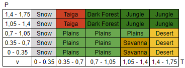

# Map-Generator-2D

Este proyecto nació con el propósito de explorar la generación de terrenos 2D en Unity mediante la utilización de Perlin Noise. El generador actualmente produce paisajes generados procedimentalmente, 
y en el futuro, se planea incorporar características adicionales, como la generación de árboles con variaciones basadas en biomas y la creación de estructuras empleando técnicas como el algoritmo de Wave Collapse. 

- Se corrigió el problema de la profundidad.
    - Cambio en la generación del mapa:
        -Anteriormente, el mapa completo se generaba en un solo fotograma, causando problemas de rendimiento en mapas extensos. Ahora, la generación del mapa se realiza por fragmentos en cada fotograma (30x30 tiles por fotograma), dividiéndose en etapas: primero, el terreno; luego, los biomas; a continuación, los ríos; y finalmente, las estructuras.
    - Se modificó el método de generación de biomas. Ahora se emplean dos perlin noise: uno para representar la temperatura y otro para las precipitaciones. El tipo de bioma generado depende de los valores obtenidos en estos ruidos.\
    
    - Se añadieron los siguientes biomas: Plains, Savanna, Desert, Jungle, Dark Forest, Taiga y Snow.
    - Se implementaron ríos utilizando Perlin Noise. Cuando el valor generado está dentro de un rango predefinido (por ejemplo, entre 0.85 y 0.95), se coloca un mosaico de agua en esa posición, generando automáticamente ríos en el mapa.
