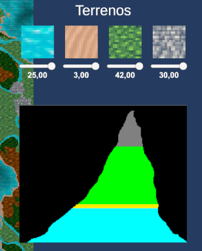

# Map-Generator-2D

Este proyecto nació con el propósito de explorar la generación de terrenos 2D en Unity mediante la utilización de Perlin Noise y otros metodos de generacion.

### Cambios al 19 de noviembre de 2023

- Se ha modificado la interfaz. Ahora, en lugar de tener todas las configuraciones en una sola pestaña, se han dividido en distintas categorías para una mejor visualización (Generación, Mundo, Terreno, Biomas, Estructuras, Filtros y Exportar).
    - **Generación:**
        - En esta categoría se encuentran todas las configuraciones relacionadas con la generación, como la profundidad, la generación instantánea (generar todo de una vez, puede causar caídas de frames), o por "chunks", etc.
    - **Mundo:** Todo lo relacionado con el tamaño del mapa y la forma del terreno.
    - **Terreno:** En función de la altura que se va a generar, agua, arena, tierra o piedra. Probablemente las categorías Mundo y Terreno se fusionen.\
        
    - **Biomas:** En esta categoría se controlará todo lo relacionado con los biomas. También se permite, a través de una matriz, modificar la aparición de cada bioma en función de la temperatura y la precipitación en cada lugar.\
        
    - **Estructuras:** Como su nombre indica, contendrá todas las configuraciones relacionadas con las estructuras.
    - **Filtros:** Aún no implementado.
    - **Exportar:** Aún no implementado.

- Se han corregido varios errores.
- Se ha pospuesto la implementación de la generación de ciudades hasta completar la generación de terrenos.

### **Cambios 2023-11-19**

- Se corrigió el problema de la profundidad.
    - Cambio en la generación del mapa:
        -Anteriormente, el mapa completo se generaba en un solo fotograma, causando problemas de rendimiento en mapas extensos. Ahora, la generación del mapa se realiza por fragmentos en cada fotograma (30x30 tiles por fotograma), dividiéndose en etapas: primero, el terreno; luego, los biomas; a continuación, los ríos; y finalmente, las estructuras.
    - Se modificó el método de generación de biomas. Ahora se emplean dos perlin noise: uno para representar la temperatura y otro para las precipitaciones. El tipo de bioma generado depende de los valores obtenidos en estos ruidos.\
    
    - Se añadieron los siguientes biomas: Plains, Savanna, Desert, Jungle, Dark Forest, Taiga y Snow.
    - Se implementaron ríos utilizando Perlin Noise. Cuando el valor generado está dentro de un rango predefinido (por ejemplo, entre 0.85 y 0.95), se coloca un mosaico de agua en esa posición, generando automáticamente ríos en el mapa.
